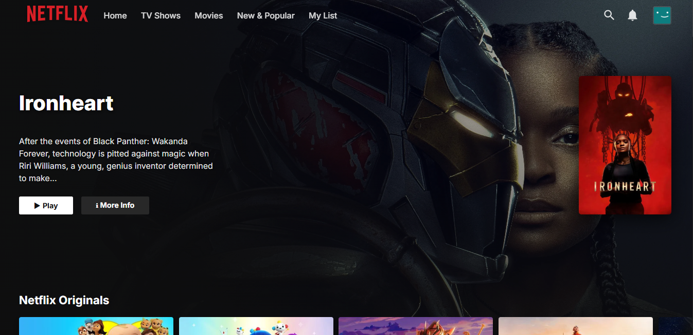
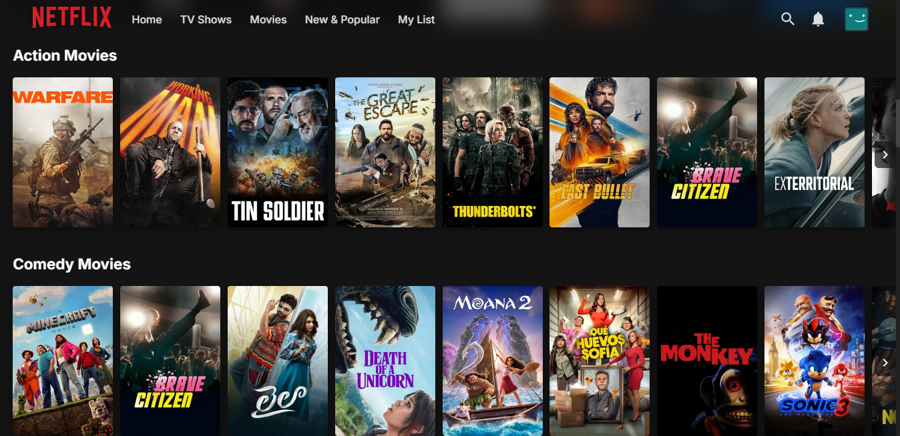
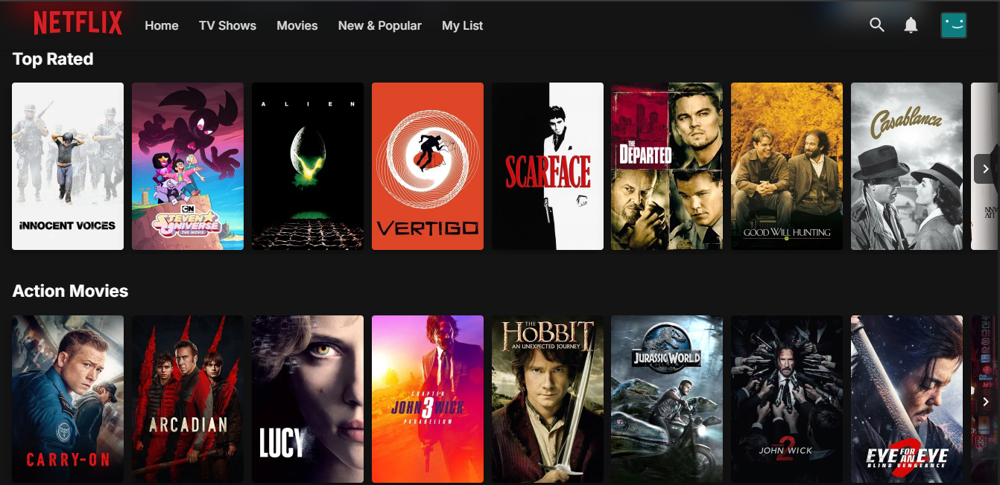
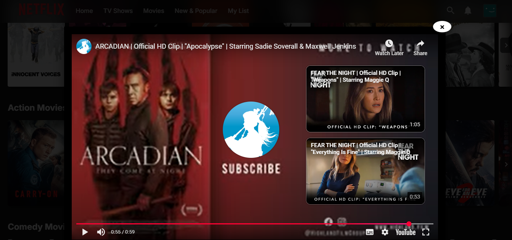

# 🎬 Netflix Clone

A modern Netflix-inspired streaming platform built with React and Vite. Enjoy a sleek UI, trending movies, TV shows, and more! 🚀

[🌐 Live Demo](https://netflix-clone-ten-sigma-28.vercel.app/)

[📦 GitHub Repository](https://github.com/Tesfamichael12/netflix-clone)

---

## ✨ Features

- 🔥 Trending, Top Rated, and Netflix Originals
- 🎥 Movie & TV Show Trailers
- 🧑‍🤝‍🧑 Popular People Section
- 🍿 Responsive, modern UI
- 🌙 Dark theme
- 🚀 Fast performance with Vite
- 📱 Mobile-friendly design
- 🛠️ Toast notifications for user feedback

---

## 🚀 Getting Started

1. **Clone the repo:**

   ```bash
   git clone https://github.com/Tesfamichael12/netflix-clone.git
   cd netflix-clone
   ```

2. **Install dependencies:**

   ```bash
   npm install
   ```

3. **Add your TMDB API key:**

   Create a `.env` file in the root directory and add:

   ```env
   VITE_TMDB_API_KEY=your_tmdb_api_key_here
   ```

4. **Run locally:**

   ```bash
   npm run dev
   ```

5. **Build for production:**

   ```bash
   npm run build
   ```

---

## 🛠️ Tech Stack

- ⚛️ React
- ⚡ Vite
- 🎬 TMDB API
- 🍰 React Toastify
- 🎨 Material UI Icons
- 🔗 Axios

---

## 📸 Screenshots

> __ > \_\_ > \_\_ > \_\_

---

## 🙌 Credits

- UI inspired by Netflix
- Data from [TMDB API](https://www.themoviedb.org/documentation/api)

---

## 📄 License

MIT License © Tesfamichael Tafere

---

> Made with ❤️ by Tesfamichael Tafere
